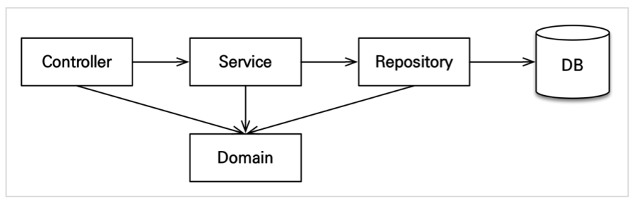
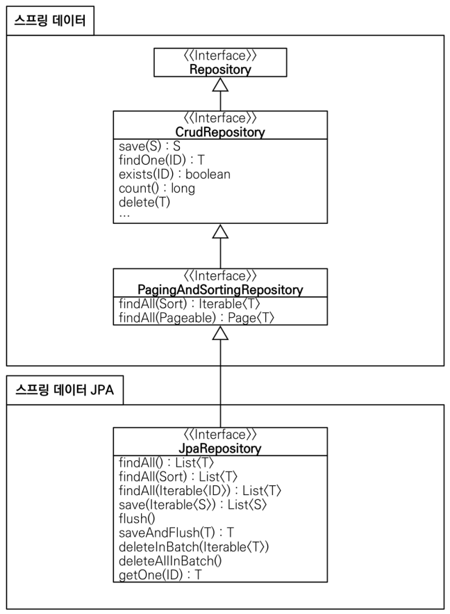

# Spring Data JPA and QueryDSL Study

# book / jpa-data / query-dsl
- Spring Data JPA 와 QueryDSL을 학습하면서 정리한 프로젝트입니다

# board service
- Spring Data JPA 학습한 내용을 바탕으로 간단한 서비스 구현해보고 추가 기능들을 적용해본 프로젝트 입니다
- Github Project 와 이슈를 정리하고 칸반보드 작성을 하면서 Git Flow 전략에 따라 진행하였습니다
- 기본 기능 : 로그인, 인증, 데이터 조회, 페이징, 댓글
- 추가 기능 : 소셜 로그인, 계층형 댓글, 보안 고도화, Swagger 문서화 
- 개발 환경 : Java 17, Gradle 7.4.1, Spring Boot 2.7.0
- 사용 기술 : Srping boot, Spring Web, Spring Data Jpa, Spring Security, MySQL, Thymeleaf
- 생산성 : Lombok, Spring Boot DevTools, Spring Boot Actuator
- 기타 : QueryDSL 5.0.0, Heroku, Bootstrap5.2
- JSON API : Rest Repositories, Rest Repositories HAL Explorer

<!-- # Application Artitecture 

# Spring Data Jpa Artitecture  

-->
